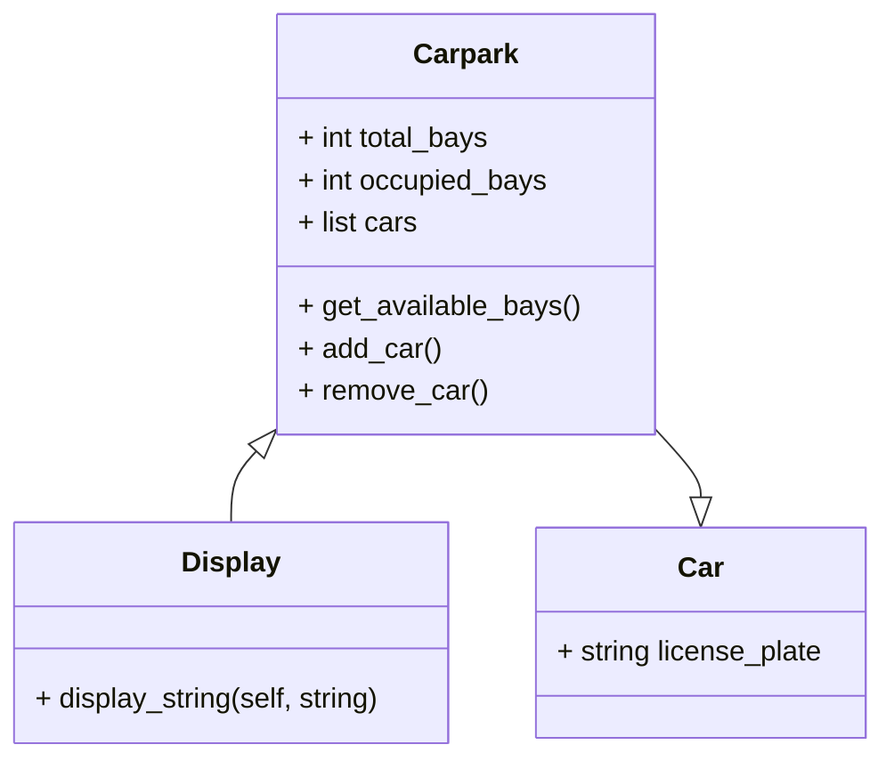

# ipriot_final_assesment
Code required for IPRIoT final assessment 

> Classes:  
> - Carpark
> - Car
> - Display

```mermaid

classDiagram
    Carpark <|-- Display
    Carpark --|> Car
    
    
    class Carpark{
        + int total_bays
        + int occupied_bays
        + list cars
        
        + get_available_bays()
        + add_car()
        + remove_car()
    }
    
    class Car{
        + string license_plate
        
    }
    
    class Display{
        + display_string(self, string)
        
    }

```
